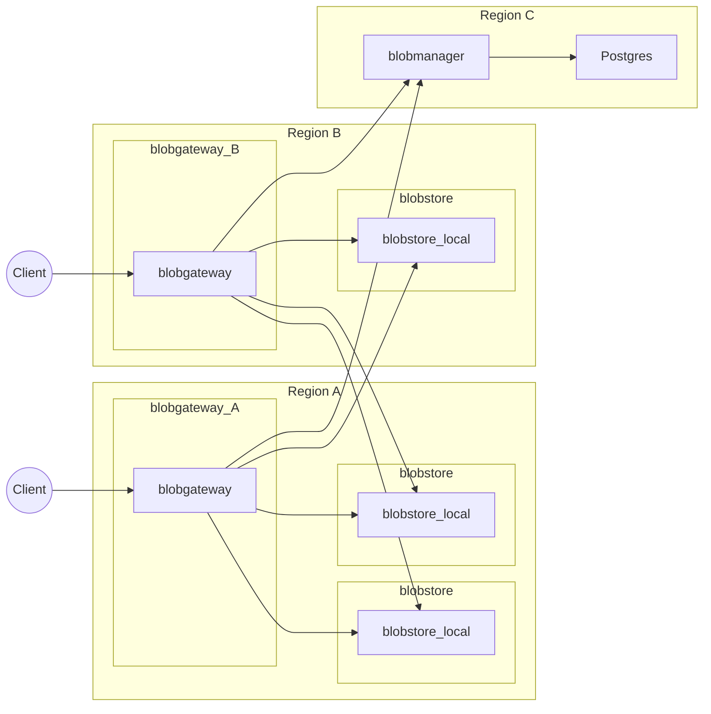

# blobservices

貧者のためのS3

## 構成図

## コンポーネント

### blobmanager

blob のメタ情報 (サイズ、チェックサム、どのstoreにどのblobがあるかなど) を保持・提供している。
blob のデータ本体には関わらない (ので帯域がそんなに太くないサーバーに置いても大丈夫)。

### blobstore_*

blob のデータ本体を保持している (逆にメタデータなどは保存していない)。
現在はローカルのファイルシステム用の実装 (`blobstore_local`) しか実装がないが、理論上は (S3など) ほとんどすべてのストレージに対応可能。

### blobgateway

blobmanager からメタ情報を、 blobstore からデータを取得し、クライアントに提供する。
クライアントは blobgateway としか通信しない。
